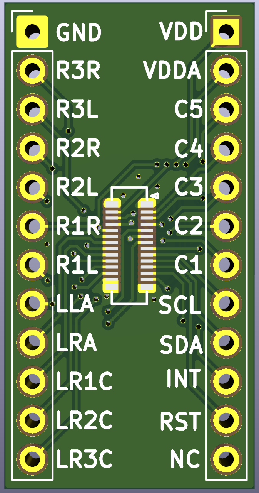
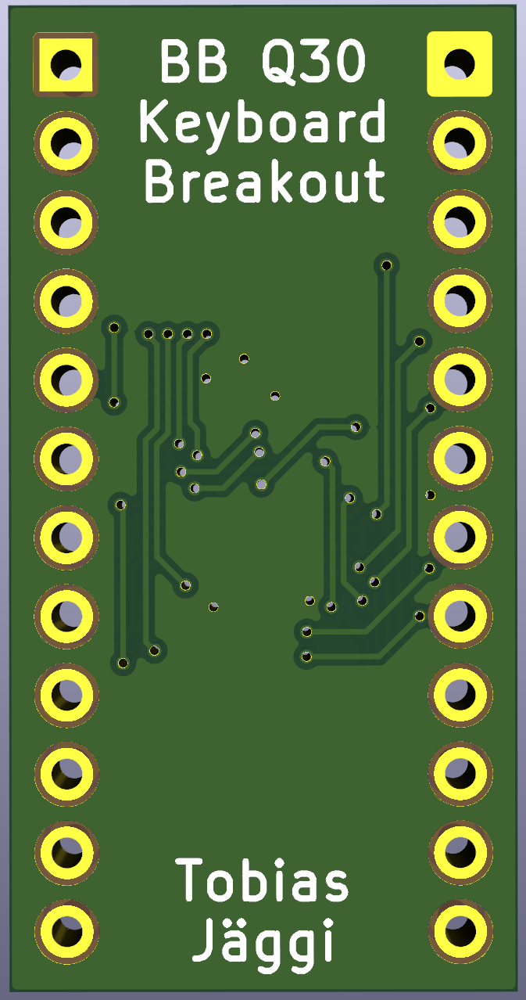

# Blackberry Q30 (Passport) Keyboard breakout board
Based on [bbq10kbd_breakout](https://github.com/arturo182/bbq10kbd_breakout), Q30 pinout reverse engineered by [TinLethax](https://hackaday.io/project/184529-reverse-engineering-bb-passport-keyboard/log/209494-k0uchpad-ble).

Blackberry Q30 keyboard connector breakout board using Hirose BM14B(0.8)-24DS-0.4V(53).

